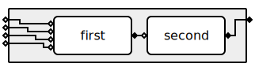
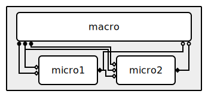

# ymmsl2svg: Visualize yMMSL workflows

Visualize yMMSL workflow as Scalable Vector Graphics (SVG).

This tool takes a yMMSL model (from a v0.2 yMMSL file) and generates an SVG image to
represent it.

## Features

- Visualize the coupling diagram for yMMSL (sub)models
- Call/release (a.k.a. macro-micro) coupling
- Dispatch coupling
- Visualize component ports: F_INIT ports are drawn on the left side of a component as
  an open diamond, O_F ports on the right side as a closed diamond, and O_I and S ports
  on the bottom as respectively a closed and an open circle.
- Visualize model ports: F_INIT ports on the left side of the model, O_F ports on the
  right side. Model O_I and S ports are not (yet) supported.
- Visualize "multi-cast" conduits, where one output port sends to multiple input ports.
- Draw conduits with filters.

Note that not `ymmsl2svg` cannot visualize all valid yMMSL configurations, see
[Roadmap](#roadmap) for a brief overview of missing functionality.

## Examples

Click to open the image in a new tab and enable interactive features, such as tooltips
with the port name when hovering over a port.

[](examples/simple-dispatch.svg)

[](examples/macro-micro-dispatched.svg)

## Usage

`ymmsl2svg` depends on a development version of
[`ymmsl-python`](https://github.com/multiscale/ymmsl-python). Therefore we don't have a
package available on PyPI yet. Until the upstream functionality is available in a
`ymmsl-python` release, we recommend to run `ymmsl2svg` with `uvx` (see the [`uv`
installation instructions](https://docs.astral.sh/uv/getting-started/installation/)):

```bash
# Create 'workflow.svg' image from the root model in 'workflow.ymmsl'
uvx --from git+https://github.com/multiscale/ymmsl2svg.git ymmsl2svg workflow.ymmsl -o workflow.svg

# Show supported options and settings
uvx --from git+https://github.com/multiscale/ymmsl2svg.git ymmsl2svg --help
```

## Roadmap

`ymmsl2svg` currently cannot visualize any valid yMMSL model yet, this section
provides a brief overview of missing features that we would like to implement in the
future: 

- **Missing yMMSL features**
  - Visualize interact coupling diagrams and time-scale bridges.
    <sup>[1](#footnote1)</sup>
  - Visualize components with multiple sub-timelines. <sup>[1](#footnote1)</sup>
  - Visualize O_I and S ports of models. <sup>[2](#footnote2)</sup>
- **Command Line Interface**
  - Allow selecting a specific model in the yMMSL configuration (currently only the
    [_root_ model](https://ymmsl-python.readthedocs.io/en/stable/api.html#ymmsl.v0_2.Configuration.root_model)
    is visualized).
  - Allow changing settings / parameters from the Command Line interface.
- **Additional features**
  - Interactive highlight of connected conduits when hovering over components or ports.

<a name="footnote1">1</a>: The SVG generation currently fails for models containing
this.<br/>
<a name="footnote1">2</a>: An SVG is generated for models containing this, but a warning
is logged and the visualization is not complete.<br/>


## Legal

Copyright 2026 ITER Organization. The code in this repository is licensed under the
[Apache-2.0 license](LICENSE.txt)
