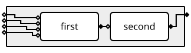
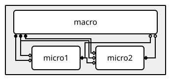

# ymmsl2svg: Visualize yMMSL workflows

Visualize yMMSL workflow as Scalable Vector Graphics (SVG).

This tool takes a yMMSL model (from a v0.2 yMMSL file) and generates an SVG image to
represent it.

## Features

- Visualize the coupling diagram for yMMSL (sub)models
- Call/release (a.k.a. macro-micro) coupling
- Dispatch coupling
- Visualize component ports: F_INIT ports are drawn on the left side of a component as
  an open diamond, O_F ports on the right side as a closed diamond, and O_I and S ports
  on the bottom as respectively a closed and an open circle.
- Visualize model ports: F_INIT ports on the left side of the model, O_F ports on the
  right side. Model O_I and S ports are not (yet) supported.
- Visualize "multi-cast" conduits, where one output port sends to multiple input ports.
- Draw conduits with filters.

Note that not `ymmsl2svg` cannot visualize all valid yMMSL configurations, see
[Roadmap](#roadmap) for a brief overview of missing functionality.

## Examples

Click to open the image in a new tab and enable interactive features, such as tooltips
with the port name when hovering over a port.

[](https://raw.githubusercontent.com/multiscale/ymmsl2svg/refs/heads/main/examples/simple-dispatch.svg)

[](https://raw.githubusercontent.com/multiscale/ymmsl2svg/refs/heads/main/examples/macro-micro-dispatched.svg)

## Usage

`ymmsl2svg` depends on a development version of
[`ymmsl-python`](https://github.com/multiscale/ymmsl-python). Therefore we don't have a
package available on PyPI yet. Until the upstream functionality is available in a
`ymmsl-python` release, we recommend to run `ymmsl2svg` with `uvx` (see the [`uv`
installation instructions](https://docs.astral.sh/uv/getting-started/installation/)):

```bash
# Create 'workflow.svg' image from the root model in 'workflow.ymmsl'
uvx --from git+https://github.com/multiscale/ymmsl2svg.git ymmsl2svg workflow.ymmsl -o workflow.svg

# Show supported options and settings
uvx --from git+https://github.com/multiscale/ymmsl2svg.git ymmsl2svg --help
```

## Live viewer

`ymmsl2svg-live` shows the diagram of a yMMSL file in your browser and re-renders it
every time you save the file, so you can edit yMMSL in your favourite text editor with
a live preview next to it. If you save a file with errors, the error message appears
above the last working diagram. If there is no working diagram yet, you see just the
error until you fix it.

To use it on your own computer, run:

```bash
ymmsl2svg-live open workflow.ymmsl
```

This opens the viewer in your browser. If no browser opens (for example on WSL), copy
the address printed in the terminal, such as `http://localhost:11000`, into your
browser. Use `--no-open-browser` if you don't want a browser to open automatically. If
that address is already in use, choose another number with `--port`, for example
`--port 12345`.

### Remote access over SSH

On a remote machine, serve on a per-user unix socket, `~/.ymmsl2svg.sock` (mode 0600):

```bash
ymmsl2svg-live socket workflow.ymmsl
```

and forward it in your `~/.ssh/config` on your own machine:

```
Host mycluster
    HostName login.example.org
    LocalForward 127.0.0.1:4334 /home/%r/.ymmsl2svg.sock
    ExitOnForwardFailure no
```

Replace `mycluster` and `login.example.org` with your remote machine, and
`/home/%r` with your home directory there if it is located elsewhere (`%r` expands to
your username on the remote machine). To use another socket, for example to view two
files at the same time, pass `--socket PATH` and forward that path instead. If you
forward to a local port other than 4334, pass it with `--local-port` so the address
printed in the terminal matches.

Then connect with `ssh mycluster` and open http://localhost:4334. Unix sockets are
host-local even on a shared filesystem, so sshd and `ymmsl2svg-live` must run on the
same login node. Where sshd prohibits unix-socket forwarding, run
`ymmsl2svg-live open --no-open-browser` and forward its TCP port instead. Note that
unlike the 0600 socket, a loopback port is connectable by other users on the same node.

### General options

Both `ymmsl2svg-live open` and `ymmsl2svg-live socket` also accept:

* `--poll`: check the file for changes by polling only, for example when changes are
  not picked up automatically.
* `--debug`: enable debug visualizations.

Run `ymmsl2svg-live open --help` or `ymmsl2svg-live socket --help` for all options.

## Roadmap

`ymmsl2svg` currently cannot visualize any valid yMMSL model yet, this section
provides a brief overview of missing features that we would like to implement in the
future: 

- **Missing yMMSL features**
  - Visualize interact coupling diagrams and time-scale bridges.
    <sup>[1](#footnote1)</sup>
  - Visualize components with multiple sub-timelines. <sup>[1](#footnote1)</sup>
  - Visualize O_I and S ports of models. <sup>[2](#footnote2)</sup>
- **Command Line Interface**
  - Allow selecting a specific model in the yMMSL configuration (currently only the
    [_root_ model](https://ymmsl-python.readthedocs.io/en/stable/api.html#ymmsl.v0_2.Configuration.root_model)
    is visualized).
  - Allow changing settings / parameters from the Command Line interface.
- **Additional features**
  - Interactive highlight of connected conduits when hovering over components or ports.
  - Add an option to draw parallel components under eachother.

<a name="footnote1">1</a>: The SVG generation currently fails for models containing
this.<br/>
<a name="footnote1">2</a>: An SVG is generated for models containing this, but a warning
is logged and the visualization is not complete.<br/>


## Legal

Copyright 2026 ITER Organization. The code in this repository is licensed under the
[Apache-2.0 license](LICENSE.txt)
